# Act
## Introduction
The project we are building is a moddable notebook named "MyCLI". It stands for Clean Logging Interface, visioning a minimalistic style notebook system with comprehensive fundamental features and highly customizable configurations, such that the website can be used in different ways based on the demands of users.

## Project Vision
MyCLI adopts the sandbox philosophy that has been proven by video games like Minecraft and Rimworld. They are famous sandbox games that have no explicit goal. Instead, the goal is defined by users. Therefore, MyCLI is more like a framework which built in with fundamental operations of text. We divided text-oriented operations into three parts: self-texting (Blackboard), one-to-one texting (Walkie-Typie), and one-to-many texting (Broadcast). Each of the namings indicates the concept:
1. Blackboard: This is the fundamental concept for the remaining two. Imagine an actual blackboard where lecture used to highlight key information; this is a "page" of Blackboard. Next, imagine there exists a long scroll, where users can only read a part of it. When users need to read other parts, they need to push up and pull down; this is the concept of the PUSH and PULL concept for operating a Blackboard.
2. Walkie-Typie: The source of the concept is obvious - the walkie-talkie, where users can instantly talk. We want to adopt this concept to text, where the typed text is streamingly shown on the other side.
3. Broadcast: There are two sources for this concept - the broadcast and the notice board. We want a place where users should actively visit, and have a broadcast-wide propagation characteristic.

Moreover, we should introduce the modding system of our product. It is like the extension features from the browser, that every user can customize which mod to be activated to provide a unique user experience for each user. Some of the mods are merely theme changing or configurations, but some connect third-party API services, and even a client LLM that runs on their machine offline, which allows users to analyse the notebook by custom prompts.

In summary, we have board-based adoption of self-messaging, one-to-one messaging, and one-to-many messaging. Some might ask: Where is many-to-many? Unfortunately, there already exists many brilliant software that are proficient in this domain, such as Discord. Adopting this feature would trade off the flexibility, which is obvious, as has been proven in video games: Most of the multiplayer games have weak compatibility with flexibility and mod culture.

This project was inspired by video game culture, git and the command line interface; therefore, we referenced many terminologies from them. To avoid ambiguity, please do refer to the background section below for context:

## Background
1. Clean "Logging" Interface: The word "log" has different meanings in different areas. In computing, it refers to those automated record systems with immutable timestamps which serve engineers; in entertainment, log refers to intentional narrative artifacts created by fictional characters that serve the story. In this project, we are trying to combine both concepts together, utilizing the timestamp concept from log on computing, with less restriction, such that users can manipulate records easily.
2. Git Concepts (Branch, Fork, Push, Pull, Commit, Checkout): Git, which is a version control system (VCS) that offers powerful functions for developers to easily track, manage, and collaborate on changes made to the source code over time. In general, every developer holds a local copy of the repository. In this project, we are not going to duplicate a git VCS. Instead, we are using the local-first concept for this project with a branch management system for categorizing notes, an extra sectioning system based on timestamp inside of a branch, and capability for users to push and pull records via the server. Further terminology explanations  will be mentioned on the corresponding sections in this report.
3. Mods: In video games' domain, mod indicates "modification", refers to alterations made to a video game that allow users to customize their game experience from visual retexturing to functional features. Initially, the UI/UX of this project prototype is considered non-user-friendly; therefore, we decided to append a mod controlling system that allows users to customize UX by activating the official-offered mods to change text expression, color theme, or even additional LLM features for aiding the UX. Moreover, due to the framework that offers various APIs for mod development, enabling programmers to develop their own one with greater ease.

## Specification (System Analyse)
There exist many text oriented software currently, here are the software list and how people typically uses them:
1. WhatsApp, which is a popular instant messaging software for people to communicate. It aggregates many kinds of features, such as one-to-one messaging and calling, group messaging and calling. But many of us will use the "text to myself" feature for agile note jotting, or simply transmit documents from mobile to PC.
2. Discord, which is a strong community aggregator, where users can join different clubs and communicate with all club members. 


### User Requirement
Suppose our project is capable for most kind of people in different pupose, let's define the expectations. Users are supposed be able to:
1. start recording at the first step on the website
2. view past records chronologically
3. organize catagorized records
4. record at anytime with any devices
5. access same pieces of records from any devices
6. exchange data with another in real time
7. browse and read the latest published content (website changelog, operation guideline, etc.)
8. customize aids (translation, AI, etc.)

#### Use Cases and Scenarios
Let us mock up scenarios for different purpose:
1. Agile Jotting with LLM Aid (Covers Requirement 1, 2, 8):
   1. User Identity: A secondary student, non-registered user.
   2. Goal: To jot down missions such as daily homeworks and assignments instantly everyday without manage each days' records
   3. Scenario (Story): After a class, the lecture destributed some daily homeworks and assignments due a few days later. The student opens the website on his mobile browser. The text area is immediately stand by for input without login or setups. He entered all homeworks and assignments with due date on the first page.
   When he back to home and opens the website, all records remain on the first page. Then he reviews the reminders and start working.
   Next day, new homeworks are destributed. He presses PUSH to open a new blank page and jot them down. The previous day's homework is still accessible, if he want, press PULL to bring them back.
   After a week, the time passes, the records grow: The newest homework always on the top, and the initial record remains bottom, but still accessable by pressing PULL button. In whole process, he never names a file, creates a folder, or deletes outdated entry. Nevertheless, after accumulating 10 records, the oldest one will be automatically be cleaned up because it reach the default cleaning threshold. Therefore, he goes to configuration page to set the max history slot to 100.
   Two weeks later, he suddently remember the examintation, but he don't want to manually search for it. Therefore, he goes to MOD page and picked a LLM. After that, a LLM entery manifests on the first page. Then he asked it about the examination. Finally, the llm tells him the information he asked about the examination with date.
2. Organizing with Branches (Covers Requirement 3):
   1. User Identity: The student from previous scenario, after several week of use.
   2. Goal: Seperate learning materials from incremental daily homework records, such that each subject is eaier to read and organize.
   3. Scenario (Stroy): The student is in three courses: Software Engineering, Data Structure, and Logical and Reasoning. The examination is getting near, he wants to have a more static place to store study materials, such that he can access them quicker. The record stacked of homework and examination has been accumulated for a while. Meanwhile, he realize that using the same approach as jotting homework will make it hard to find.
   Although he never creates or named the current branch, he realized it is because the system implicitly automatically do this for him. The stack which stores homework is a branch called "master". He needs a new branch to store study materials. So he created a blank new branch, and named it "study". Now he have two branches, but he is still in branch "master". He then pressed "CHECKOUT" to switch to "study" brach, so that he can edit it. 
   The process is similar to jotting down homework, but this time, the storing object is files. He then attached the files into a page, pressed "PUSH" to iterate the process untill all subject is moved. It implicitly catagorized the material. Each page should have one subject material only.
   Henceforth, whenever he wants to visit different content from homework and study materials, he just need to press "CHECKOUT" to swtich branch.
   Finally, after a semester, he is no longer need the materials. Therefore, he deleted the "study" branch. 
3. Data Transmission (Covers Requirement 4, 5, 6):
   1. User Identity: The student from scenario 1 and 2 and his girl friend
   2. Goal: A user can access his own record from different device, and transmit data to other user. Authentication is needed.
   3. Scenario (Story): The student has been accessing the website all along with mobile device. He realized that all records are stored locally. To solve this, he registered an account with a simple UID and passcode. The system doesn't require email or phone number. Then he pressed COMMIT to upload the homework branch to the server. Then, on his PC, he logs in to the same account, he can see the record is non-local and shows "async", which indicates it is not on the PC yet. He then pressed "CHECKOUT", the branch status shows "local" and "synced".
   Suddenly, his home router was downed for a moment, but he doesn't worry, the website can work offline; he just need to press COMMIT after the router is online.
   He then realized that he needs to manually do the sync job. Therefore, he goes to the configuration page, and turns on the auto-sync.
   One day, her girl friend want his study material. While he only have WhatsApp, her girl friend only uses Line. However, registering an instant messaging app needs email or phone number. To make it quicker, he recommanded this website to his girl friend. After both side have a registered accound, they can start exchange data.
4. Official Announcements (Covers Requirement 7):
   1. User Identiy: Lectures and students
   2. Goal: Assume a school is the host of the website, the administrator will manage the permissions for all users. Lecturers who own permission are able to publish a one-to-many message publicly.
   3. Scenario: A university hosts MyCLI on its own server for internal communication. The IT department is responsible to manage the account for all students and lectures. All lectures has been destributed an account with a "title", allow them to publish a public branch, such that all users can see the news. Some lectures are announcing new homeworks on the website publicly. Although the operation logic is similar on how a branch does, only the person who owned a corresponing "title" can modify their own public branch.   
   
#### Use Case UML

Three actor levels interact with MyCLI. Each higher-level actor inherits all capabilities of the level below it. Use cases are grouped by the three Board scopes (Blackboard, Walkie-Typie, Broadcast) plus cross-cutting concerns (Auth, Files, MODs, Config). The `<<include>>` relationship indicates a mandatory sub-flow; the `<<extend>>` relationship indicates an optional extension triggered by a condition.

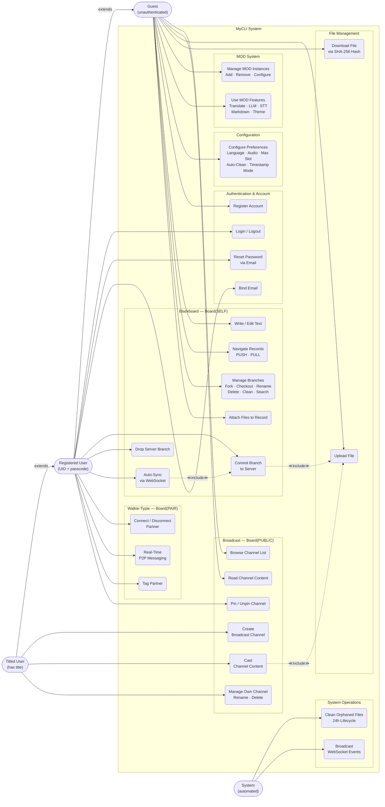

**Actor–Requirement Traceability:**

| Actor | Covers Requirements | Key Capabilities |
|-------|-------------------|------------------|
| Guest | 1, 2, 3, 7, 8 | Local-first recording, branch management, read broadcasts, MODs |
| Registered User | 4, 5, 6 | Multi-device sync (Commit/Checkout), P2P communication (WT), channel pinning |
| Titled User | 7 | Broadcast channel ownership (Create/Cast/Rename/Delete) |
| System | — | Orphaned file cleanup (24h cron), WebSocket event broadcasting |

### System Requirement
#### Functional Requirement
1. Blackboard - The system shall:
   1. provide immediately available text area on the first step of accessing the website
   2. support file attachment on each page
   3. store all records in IndexedDB to uphold the local-first principle
   4. support simplistic chronological navigation: PUSH and PULL buttons to navigate records
   5. support black page auto-clean to improve the UX of navigation
   6. support record auto-clean whenever accumulated records reach the dedicated threshold
   7. order pages based on the timestamp of each page
   8. support update timestamp on a page is updated, such that it goes to the front (assume user editing a page indicates the higher priority)
   9. create a blank page after hitting the PUSH button on the latest record, such that the user can incrementally append records
   10. support forking a branch, which creates a duplicate containing all previous records
   11. support clearing a branch, which clears all records inside a branch
   12. support CRUD on a branch
   13. support branch renaming
   14. support switching the branch from local
   15. support upload/ download branch from server
   16. support deleting the branch on the server
   17. support configurations for the NO. 4, 5, 6 functional requirements
2. Walkie-Typie - The system shall:
   18. support real-time peer-to-peer text communication (including file attachment) between two registered users
   19. support connecting to each other by UID
   20. support disconnect others
   21. create a twin board for both sides after the connection
   22. display both sides of the board on a single page
   23. provide same operation logic as Blackboard does
   24. auto-commit one side's board after editions
   25. auto sync the other side's board
   26. restrict the behaviour on not owned broad (read only, still can PUSH and PULL pages)
   27. support renaming connections
   28. support configurations as Blackboard does
3. Boardcast - The system shall:
   29. allow any users, including non-authenticated guests, to browse and read existing Broadcast channels
   30. restrict behaviour for non-titled users on a channel (same logic as not owned broad on Walkie-Typie)
   31. provide the same logic of operation for the titled UID as the Blackboard page, and the branch does
   32. restrict each channel's CRUD permission so that each channel created by a UID with a title, that channel is bound to the title of the creator; only the UID with the corresponding title can modify it
4.  Mods - The system shall:
   33. provide a series of officially made mods
   34. support configuration for each mod
   35. support instantiating a mod multiple times; each mod instance doesn't share configurations
   36. support adding a mod functional button on a dedicated page, based on the definitions that are defined in each mod; each instance's button is independent

#### Non-functional Requirement (NFR)
1. Performance- The system shall:
   1. auto save all board page content from Blackboard, Walkie-Typie, and Broadcast after an input action + 200ms debounce, to avoid too many system writing behaviours.
   2. ompress the HTTP responses to reduce bandwidth consumption; using Nginx Gzip, with a minimum length of 256 bytes for files
   3. cache the frequently requested data to reduce server database burden; setting up Time To Live (TTL) for branch list, branch details, broadcast channels, with TTL smaller than 120 seconds
   4. do SHA-1 for the attached files to deduplication, because the allowed maximum file size to be attached is 1GB. We do not expect multiple attachments of a 1GB file to create multiple instances; deduplicating by SHA-256 hashing could reduce the occupied storage of both client and server.
   5. pre-cache the static resources, such that the website can be instantly loaded; we can use Service Worker to cache the HTML, CSS, JS, and audio files.
   6. define the API request timeouts in 15s as the default, to avoid hanging connections.
   7. use database indexing to optimize query performance
2. Reliability - The system shall:
   8. eternalize the board data to clients' local before any sync behaviour to the server
   9. auto restart the server services (Docker Containers)
   10. retry the queue jobs after it fails for 3 times
   11. maintain the server database referential integrity via cascading deletes
   12. auto clean orphaned files (not being attached by any of the pages) after 24 hours to prevent residuals
   13. provide structured error responses for all API failures, such as 400, 404, and 401 errors.
   14. use SHA-256 hashing for content-addressed storage for integrity verification and deduplication, as mentioned in the performance NFR.
   15. update the indexedDB version on data structure changes to prevent data loss.
3.  Usability - The system shall:
   16. officially support fundamental theme-changing extensions for language and color patterns, such as Chinese and Light Mode.
   17. provide i18n json files for anyone to easily customize their own UI texts
   18. provide responsive layout across mobile and desktop
   19. support touch-based interactions
   20. installable as a Progressive Web App (PWA) for an offline use case
   21. provide contextual hints for complicated features
   22. provide audio feedback for navigation actions
   23. animate transactions
   24. provide rich customizable options of the NFR of NO. 16, 19, 20, 21, 22, etc.
   25. provide creative officially made mods as templates, also some API for mods provided as the framework, such that other developers can more easily develop their own mods
4. Portability - The system shall:
   26.   auto adapt the most suitable CSS depending on the screen size, operating system, and the browser
   27.   provide a comprehensive Dockerized system and push it to GitHub, so that other developers can be easier to one-shot deploy and host the server
   28.   provide .env.example with defined variable names for easier deployment for developers
5. Security - The system shall:
   29.  hash the passwords before any storage behaviour
   30.  implement rate limiting for API ports to prevent abusement
   31.  validate the authentication input on the client, such as password, email, and UID length and format.
   32.  validate the attached files, reject high-risk file extensions such as php, exe, and html, etc.
   33.  provide saver DOM operations; never use innerHTML, but textContent, to avoid Cross-Site Scripting (XSS)
   34.  parameterize queries to prevent SQL injections
   35.  set security headers to mitigate common web attacks
   36.  protect sessions with secure cookie attributes
   37.  use content-addressed hashing (SHA-256) as an access token for file accesses
   38. isolate backend services from direct external access
   39. defined a .gitignore file for the GitHub repository of this project
   40. define a .env file that includes all API keys and passwords, such as smtp.google.com and pgAdmin configurations; the .env file will be included in .gitignore, we will provide a .env.example file instead
   41. define .htaccess to reject unpermitted access requests

## System Modeling (System Design)
!!!!!!!!!!!!!!!!!!!!!!!!!!!!!!!!!!!!!!!!!!!!

### User Interface Design


#### Entity Relationship Diagram (ERD)

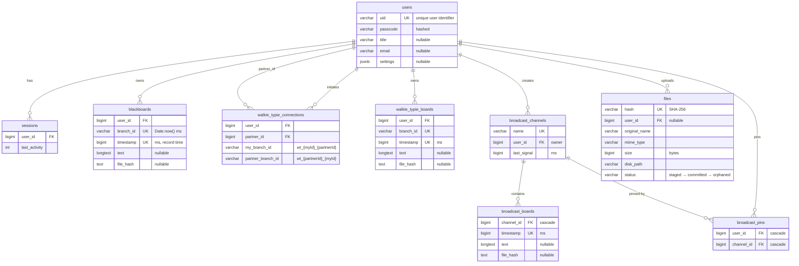

#### IndexedDB Schema (Dexie.js — Client-Side Primary Storage)

```mermaid
erDiagram
    blackboard {
        compound_pk PK "[owner+branch_id+timestamp]"
        string owner "sync state tag"
        string branch_id "Date.now() ms"
        bigint timestamp "ms"
        string text "record content"
    }

    walkie_typie {
        compound_pk PK "[branch_id+timestamp]"
        string branch_id "wt_{myId}_{partnerId}"
        bigint timestamp "ms"
        string branch "WE or THEY"
        string text "record content"
    }

    broadcast_boards {
        compound_pk PK "[local_channel_id+timestamp]"
        int local_channel_id "FK to broadcast_channels"
        bigint timestamp "ms"
        string text "record content"
    }

    broadcast_channels {
        int local_id PK "auto-increment"
        string name "display name"
        int server_channel_id "nullable"
    }

    file_blobs {
        string hash PK "SHA-256"
        blob blob "binary data"
        string status "pending | synced"
    }
```

> **Note:** 6 schema versions (v1–v6). v6 migrated camelCase → snake\_case with full data clear. Key differences from PostgreSQL: no `user_id` FK (single-user client), `owner` field encodes sync state, `file_blobs` stores actual binary data (server `files` table stores only metadata + disk path).

#### Data Flow: Local-First Sync Architecture

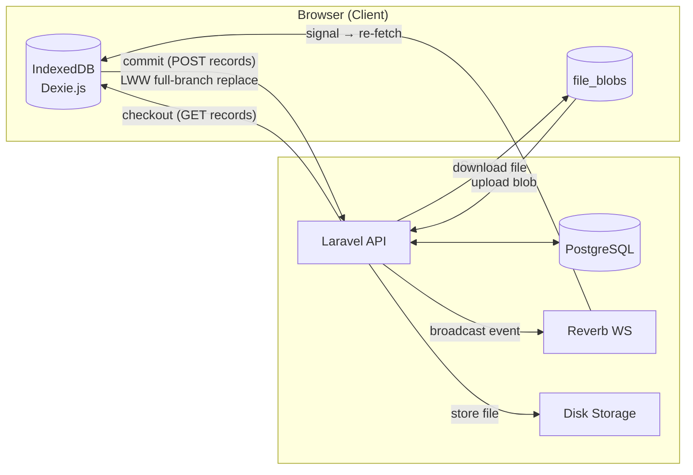

### Unified Modeling Language Diagrams (UML)


#### Class UML

**Backend Class Diagram (Laravel)**

```mermaid
classDiagram
    direction TB

    class User {
        +string uid
        +string passcode
        +jsonb settings
    }

    class File {
        +string hash
        +string status
    }

    class AuthController {
        +executeCommand()
    }

    class BlackboardController {
        +commit()
    }

    class WalkieTypieController {
        +signal()
        +commitBoard()
    }

    class BroadcastChannelController {
        +cast()
    }

    class FileController {
        +upload()
        +download()
    }

    class SettingsController

    class LlmController {
        +chatStream()
    }

    class TranslationController {
        +translate()
    }

    class SpeechController {
        +recognize()
    }

    class AuthService {
        +executeCommand()
    }

    class BlackboardService {
        +commit()
    }

    class WalkieTypieBoardService {
        +commit()
    }

    class BroadcastChannelService {
        +cast()
    }

    class FileService {
        +upload()
        +markOrphaned()
    }

    class SettingsService

    class BroadcastChannelUpdated {
        +int channelId
        +string action
    }

    class WalkieTypieConnectionUpdated {
        +array connectionData
    }

    class WalkieTypieContentUpdated {
        +array contentData
    }

    class BlackboardUpdated {
        +string branchId
        +string deviceId
    }

    class WalkieTypieSignal {
        +string senderUid
        +string partnerUid
    }

    AuthController --> AuthService
    BlackboardController --> BlackboardService
    WalkieTypieController --> WalkieTypieBoardService
    BroadcastChannelController --> BroadcastChannelService
    FileController --> FileService
    SettingsController --> SettingsService
    BlackboardService --> FileService
    BroadcastChannelService --> FileService

    BlackboardService ..> BlackboardUpdated : fires
    BroadcastChannelService ..> BroadcastChannelUpdated : fires
    WalkieTypieController ..> WalkieTypieConnectionUpdated : fires
    WalkieTypieController ..> WalkieTypieContentUpdated : fires
    WalkieTypieController ..> WalkieTypieSignal : fires

    User "1" --> "*" File : uploads
```

**Frontend Module Diagram (ES Modules)**

```mermaid
classDiagram
    direction TB

    class BBCore {
        +getRecord()
        +addRecord()
        +updateText()
    }

    class BBVCS {
        +push()
        +pull()
        +commit()
    }

    class BBSync {
        +startListening()
        +scheduleCommit()
    }

    class AuthManager {
        +init()
    }

    class WTCore {
        +init()
    }

    class BCChannel {
        +openChannel()
        +closeChannel()
    }

    class ModState {
        +addInstance()
        +removeInstance()
    }

    class IndexedDB {
        <<Dexie v6>>
        +blackboard Table
        +walkie_typie Table
        +broadcast_boards Table
        +broadcast_channels Table
        +file_blobs Table
    }

    class EchoService {
        +getEcho()
        +releaseEcho()
    }

    BBVCS --> BBCore : reads/writes records
    BBVCS --> IndexedDB : via BBCore
    BBSync --> BBVCS : triggers commit
    BBSync --> EchoService : listens WebSocket
    WTCore --> EchoService : private channel
    BCChannel --> EchoService : public channel
    BCChannel --> IndexedDB : owner mode storage
    AuthManager ..> WTCore : auth:updated event
    ModState --> IndexedDB : via localStorage
```

#### Sequence Diagram

**Blackboard Commit Flow**

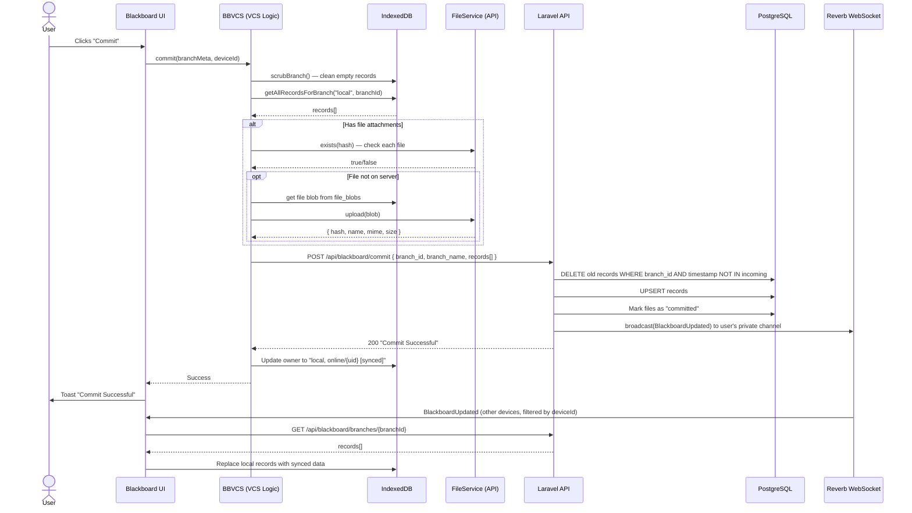

**Walkie-Typie Real-Time Communication**

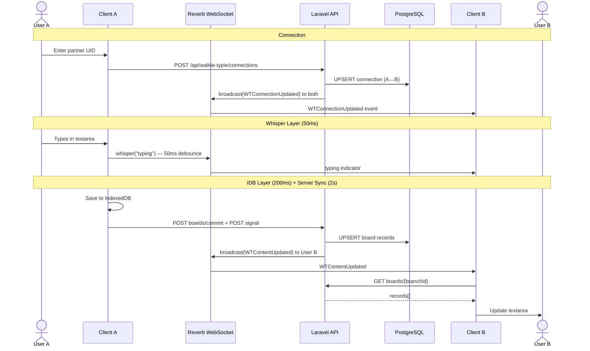

**Broadcast Cast Flow**

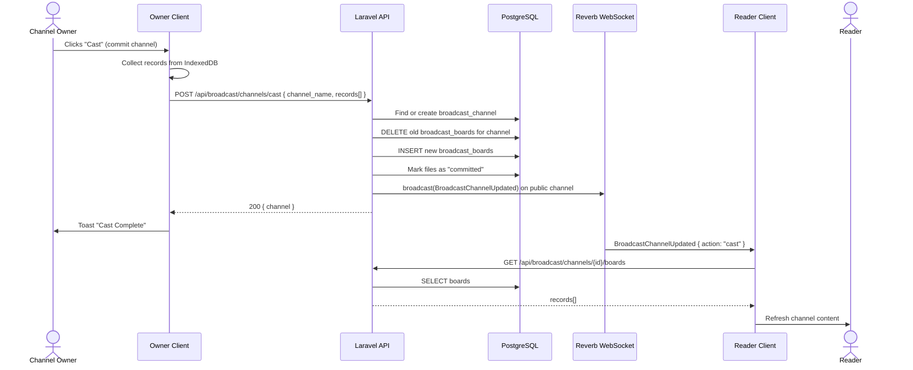

#### State Diagram

**Blackboard Navigation State Machine**

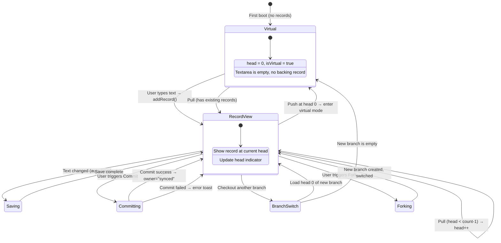

**File Status Lifecycle**

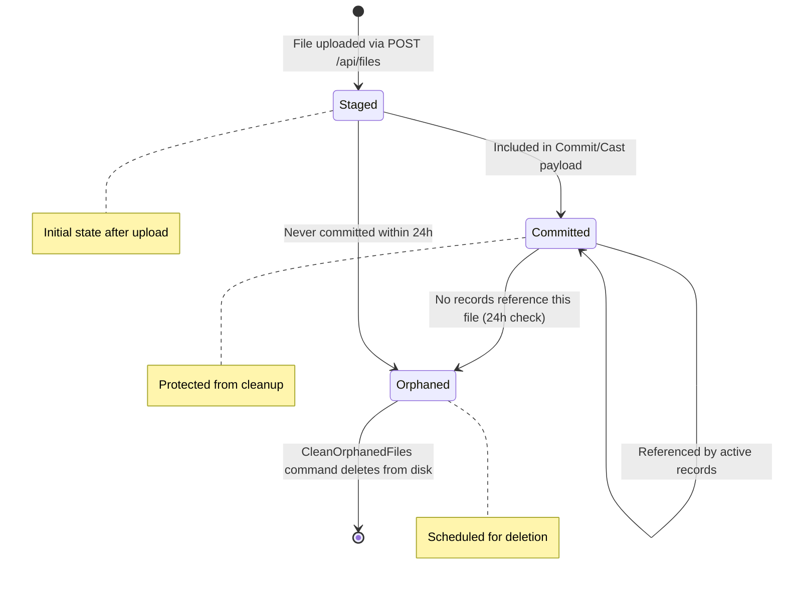

**Walkie-Typie Connection State Machine**

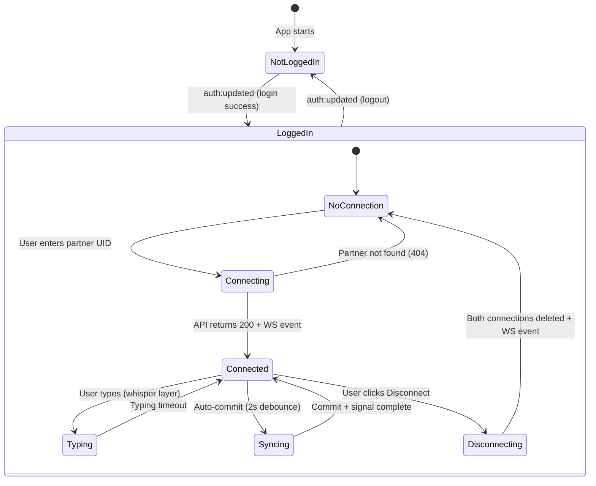

**Navigation State Machine**

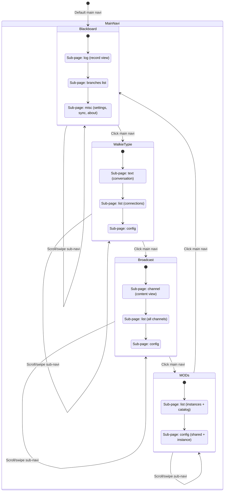

#### Activity Diagram

**Blackboard Commit Workflow**

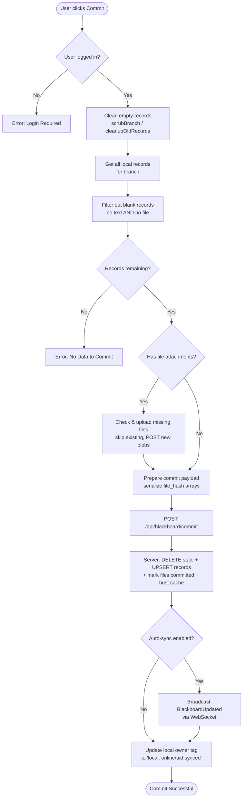

**MOD System Boot Sequence**

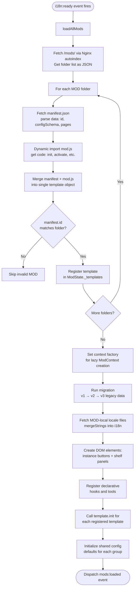

**User Authentication Flow**

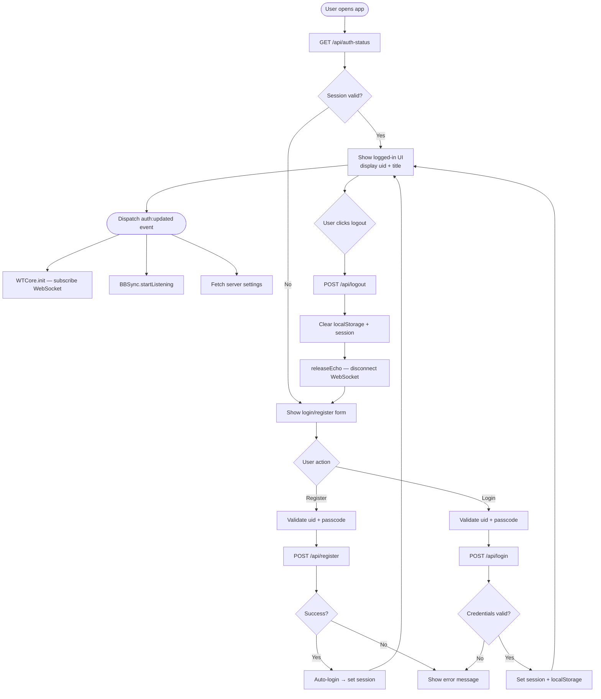

#### Deployment Diagram

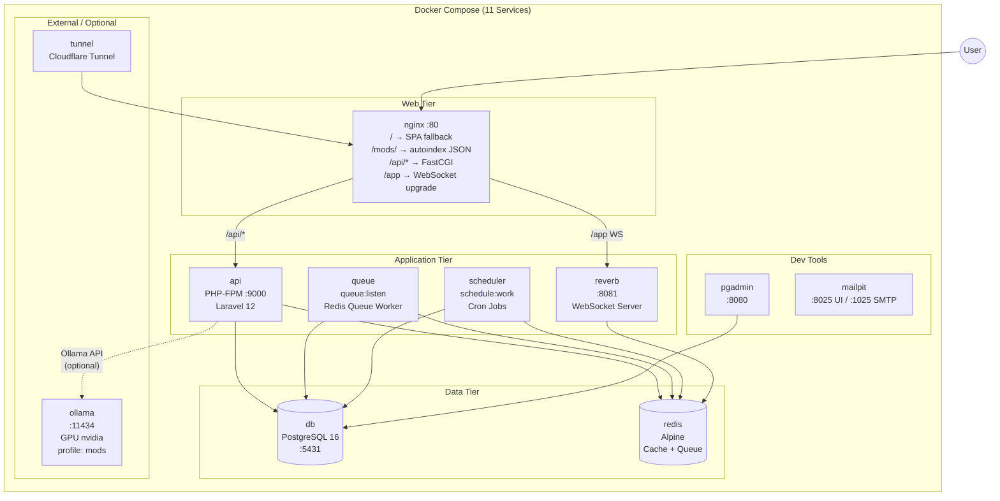

