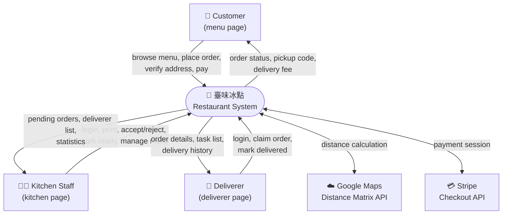
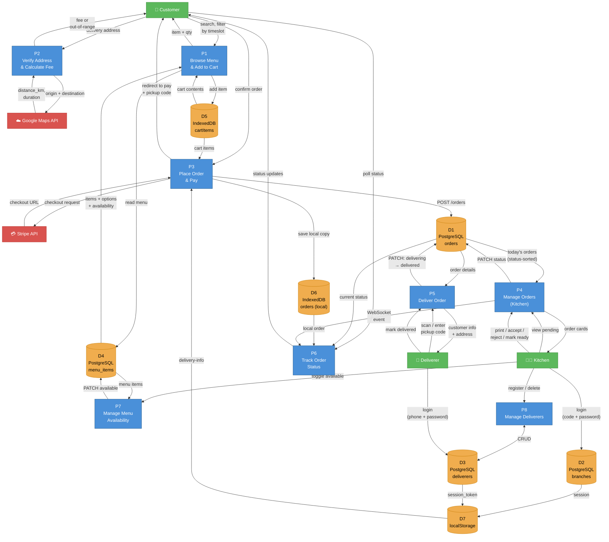
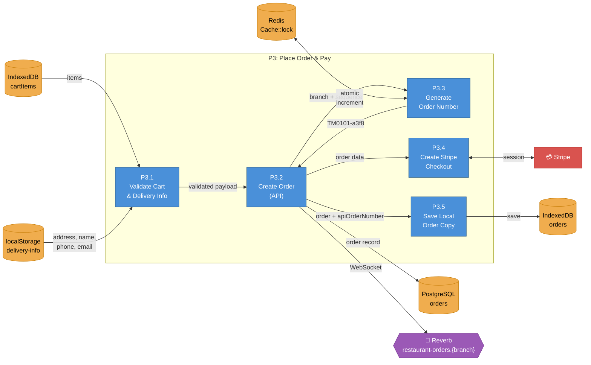
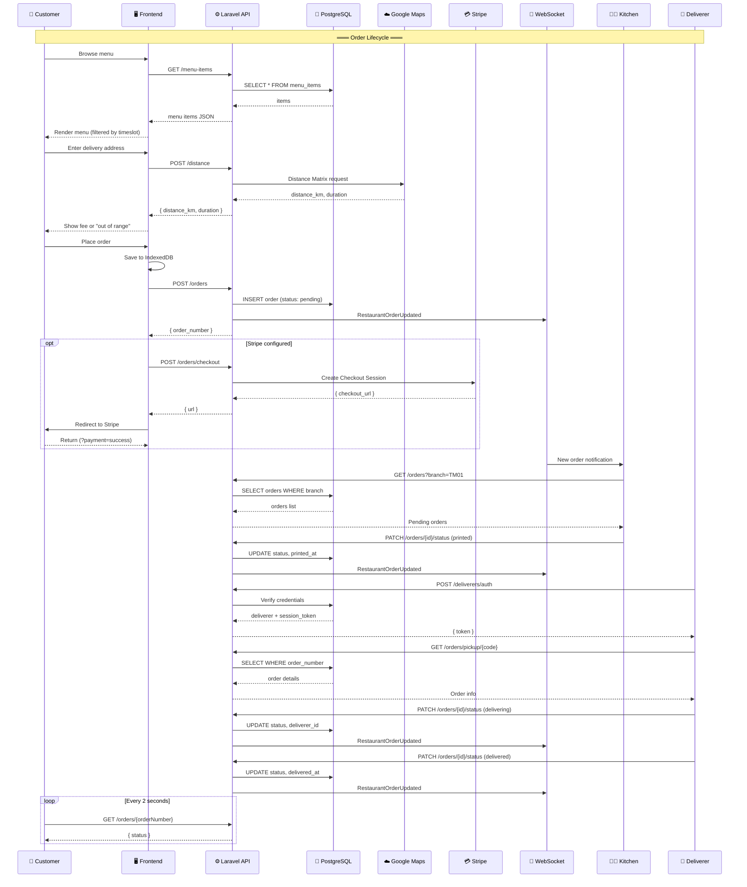

# Restaurant Module — Diagrams

> Last updated: 2026-03-20

---

## 1. Data Flow Diagram (DFD)

### Level 0 — Context Diagram



### Level 1 — Process Decomposition



### Level 2 — Order Processing Detail



---

## 2. Use Case Diagram (3 Actors)

```mermaid
flowchart TB
    %% ── Actors ──
    Customer["👤 Customer\n(顧客)"]
    Kitchen["👨‍🍳 Kitchen Staff\n(廚房人員)"]
    Deliverer["🚴 Deliverer\n(外送員)"]

    subgraph System["🏪 臺味冰點 Restaurant System"]
        direction TB

        subgraph Ordering["📋 Ordering"]
            UC1(["Browse Menu\n瀏覽菜單"])
            UC2(["Search Menu\n搜尋菜單"])
            UC3(["Add to Cart\n加入購物車"])
            UC4(["Verify Address\n驗證地址"])
            UC5(["Place Order\n下單"])
            UC6(["Pay via Stripe\n付款"])
            UC7(["View Order History\n查看歷史"])
        end

        subgraph KitchenOps["🍳 Kitchen Operations"]
            UC8(["Kitchen Login\n廚房登入"])
            UC9(["View Pending Orders\n查看待處理訂單"])
            UC10(["Print Order\n印單"])
            UC11(["Accept / Reject Order\n接單 / 拒絕"])
            UC12(["Mark Order Ready\n備餐完成"])
            UC13(["View Order History\n查看訂單歷史"])
            UC14(["Toggle Menu Availability\n切換菜品供應"])
            UC15(["Switch Timeslot\n切換時段"])
        end

        subgraph DelivererOps["🚚 Delivery Operations"]
            UC16(["Deliverer Login\n外送員登入"])
            UC17(["Scan / Enter Pickup Code\n掃碼 / 輸入取餐碼"])
            UC18(["Claim Delivery\n認領配送"])
            UC19(["Mark Delivered\n確認送達"])
            UC20(["View Active Task\n查看進行中任務"])
            UC21(["View Delivery History\n查看配送紀錄"])
        end

        subgraph Admin["⚙️ Administration"]
            UC22(["Register Deliverer\n註冊外送員"])
            UC23(["Delete Deliverer\n刪除外送員"])
            UC24(["Clear Orders\n清空訂單"])
            UC25(["View Statistics\n查看統計"])
        end

        subgraph Shared["🌐 Shared"]
            UC26(["Switch Language\n切換語言"])
        end
    end

    %% ── Customer Associations ──
    Customer --- UC1
    Customer --- UC2
    Customer --- UC3
    Customer --- UC4
    Customer --- UC5
    Customer --- UC6
    Customer --- UC7
    Customer --- UC26

    %% ── Kitchen Associations ──
    Kitchen --- UC8
    Kitchen --- UC9
    Kitchen --- UC10
    Kitchen --- UC11
    Kitchen --- UC12
    Kitchen --- UC13
    Kitchen --- UC14
    Kitchen --- UC15
    Kitchen --- UC22
    Kitchen --- UC23
    Kitchen --- UC24
    Kitchen --- UC25
    Kitchen --- UC26

    %% ── Deliverer Associations ──
    Deliverer --- UC16
    Deliverer --- UC17
    Deliverer --- UC18
    Deliverer --- UC19
    Deliverer --- UC20
    Deliverer --- UC21
    Deliverer --- UC26

    %% ── Include / Extend relationships ──
    UC5 -.->|"«includes»"| UC4
    UC5 -.->|"«extends»"| UC6
    UC18 -.->|"«includes»"| UC17

    %% ── Styling ──
    classDef actor fill:#2ecc71,stroke:#27ae60,color:#fff
    classDef usecase fill:#3498db,stroke:#2980b9,color:#fff
    classDef system fill:#ecf0f1,stroke:#bdc3c7,color:#2c3e50

    class Customer,Kitchen,Deliverer actor
    class UC1,UC2,UC3,UC4,UC5,UC6,UC7 usecase
    class UC8,UC9,UC10,UC11,UC12,UC13,UC14,UC15 usecase
    class UC16,UC17,UC18,UC19,UC20,UC21 usecase
    class UC22,UC23,UC24,UC25,UC26 usecase
```



### Use Case Summary Table

| # | Use Case | Customer | Kitchen | Deliverer |
|---|----------|:--------:|:-------:|:---------:|
| 1 | Browse Menu | ✅ | | |
| 2 | Search Menu | ✅ | | |
| 3 | Add to Cart | ✅ | | |
| 4 | Verify Delivery Address | ✅ | | |
| 5 | Place Order | ✅ | | |
| 6 | Pay via Stripe | ✅ | | |
| 7 | View Order History | ✅ | ✅ | |
| 8 | Kitchen Login | | ✅ | |
| 9 | View Pending Orders | | ✅ | |
| 10 | Print Order | | ✅ | |
| 11 | Accept / Reject Order | | ✅ | |
| 12 | Mark Order Ready | | ✅ | |
| 13 | Toggle Menu Availability | | ✅ | |
| 14 | Switch Timeslot | | ✅ | |
| 15 | Deliverer Login | | | ✅ |
| 16 | Scan / Enter Pickup Code | | | ✅ |
| 17 | Claim Delivery | | | ✅ |
| 18 | Mark Delivered | | | ✅ |
| 19 | View Active Task | | | ✅ |
| 20 | View Delivery History | | | ✅ |
| 21 | Register Deliverer | | ✅ | |
| 22 | Delete Deliverer | | ✅ | |
| 23 | Clear Orders (Console) | | ✅ | |
| 24 | View Statistics | | ✅ | |
| 25 | Switch Language | ✅ | ✅ | ✅ |

### «includes» / «extends» Relationships

| Relationship | From | To | Type |
|-------------|------|----|------|
| Place Order **includes** Verify Address | UC5 | UC4 | «includes» — address must be verified before order |
| Place Order **extends** Pay via Stripe | UC5 | UC6 | «extends» — payment is optional (Stripe may not be configured) |
| Claim Delivery **includes** Scan/Enter Code | UC18 | UC17 | «includes» — must identify order before claiming |

---

## 3. Interaction Flow (Sequence)



---

## 4. Class Diagram

### 4.1 Backend — Controllers, Services, Events, Mail

```mermaid
classDiagram
    direction TB

    %% ════════════════════════════════════════════
    %% CONTROLLERS
    %% ════════════════════════════════════════════

    class RestaurantOrderController {
        #RestaurantOrderService orderService
        +index(Request) JsonResponse
        +store(Request) JsonResponse
        +show(string orderNumber) JsonResponse
        +showByPickupCode(string code) JsonResponse
        +updateStatus(Request, string orderNumber) JsonResponse
        +listByDeliverer(int delivererId) JsonResponse
        +clearOrders(Request) JsonResponse
        +distance(Request) JsonResponse
        +createCheckout(Request) JsonResponse
    }

    class RestaurantBranchController {
        #RestaurantBranchService branchService
        +index() JsonResponse
        +store(Request) JsonResponse
        +authenticate(Request) JsonResponse
    }

    class RestaurantDelivererController {
        #RestaurantDelivererService service
        +index() JsonResponse
        +store(Request) JsonResponse
        +authenticate(Request) JsonResponse
        +logout(Request) JsonResponse
        +me(Request) JsonResponse
        +updateStatus(Request, int id) JsonResponse
        +destroy(int id) JsonResponse
    }

    %% ════════════════════════════════════════════
    %% SERVICES
    %% ════════════════════════════════════════════

    class RestaurantOrderService {
        #db() DatabaseManager
        +createOrder(array data) object
        +getOrder(string orderNumber) object?
        +listTodayOrders(string? branchCode) array
        +clearOrders(string? branchCode) int
        +listByDeliverer(int delivererId) array
        +updateStatus(string orderNumber, string status, array extra) object?
        #generateOrderNumber(string? branchCode) string
    }

    class RestaurantBranchService {
        #db() DatabaseManager
        +createBranch(string code, string name) object
        +listBranches() array
        +findByCode(string code) object?
        +authenticate(string code, string password) object?
    }

    class RestaurantDelivererService {
        #db() DatabaseManager
        +register(string name, string phone, string password) object
        +authenticate(string phone, string password) array?
        +validateSession(string token) object?
        +logout(string token) void
        +list() array
        +findById(int id) object?
        +updateStatus(int id, string status) void
        +delete(int id) void
    }

    %% ════════════════════════════════════════════
    %% EVENT & MAIL
    %% ════════════════════════════════════════════

    class RestaurantOrderUpdated {
        <<ShouldBroadcastNow>>
        +string orderNumber
        +string action
        +string? branchCode
        +broadcastOn() Channel
        +broadcastAs() string
        +broadcastWith() array
    }

    class RestaurantReceiptMail {
        <<Mailable>>
        +object order
        +mixed items
        +build() Mailable
    }

    %% ════════════════════════════════════════════
    %% EXTERNAL SERVICES (used by controllers)
    %% ════════════════════════════════════════════

    class GoogleMapsAPI {
        <<external>>
        +distanceMatrix(origin, dest) JSON
    }

    class StripeCheckout {
        <<external>>
        +createSession(lineItems, urls) Session
    }

    %% ════════════════════════════════════════════
    %% DATA STORES
    %% ════════════════════════════════════════════

    class PostgreSQL_orders {
        <<table>>
        +bigint id PK
        +varchar order_number UK
        +varchar status
        +integer total
        +jsonb items
        +bigint branch_id FK
        +varchar delivery_address
        +integer delivery_fee
        +varchar customer_name
        +varchar customer_phone
        +varchar customer_email
        +text comment
        +bigint deliverer_id FK
        +integer estimated_minutes
        +timestamp printed_at
        +timestamp delivered_at
    }

    class PostgreSQL_branches {
        <<table>>
        +bigint id PK
        +varchar code UK
        +varchar name
        +varchar password
    }

    class PostgreSQL_deliverers {
        <<table>>
        +bigint id PK
        +varchar name
        +varchar phone UK
        +varchar password
        +varchar status
        +varchar session_token UK
    }

    class PostgreSQL_menu_items {
        <<table>>
        +bigint id PK
        +jsonb category
        +jsonb name
        +integer price
        +jsonb options_schema
        +jsonb timeslots
        +integer sort_order
        +boolean available
    }

    class RedisCache {
        <<cache>>
        +restaurant:orders:today
        +restaurant:deliverers (30s TTL)
        +restaurant:order-seq:PREFIX:DATE (lock)
    }

    %% ════════════════════════════════════════════
    %% RELATIONSHIPS
    %% ════════════════════════════════════════════

    %% Controller → Service (dependency injection)
    RestaurantOrderController --> RestaurantOrderService : injects
    RestaurantBranchController --> RestaurantBranchService : injects
    RestaurantDelivererController --> RestaurantDelivererService : injects

    %% Controller → External APIs
    RestaurantOrderController ..> GoogleMapsAPI : HTTP GET
    RestaurantOrderController ..> StripeCheckout : SDK call

    %% Service → Data Stores
    RestaurantOrderService --> PostgreSQL_orders : CRUD
    RestaurantOrderService --> PostgreSQL_branches : read (findByCode)
    RestaurantOrderService --> RedisCache : lock + cache
    RestaurantBranchService --> PostgreSQL_branches : CRUD
    RestaurantDelivererService --> PostgreSQL_deliverers : CRUD
    RestaurantDelivererService --> RedisCache : cache (30s)

    %% Service → Event / Mail
    RestaurantOrderService ..> RestaurantOrderUpdated : dispatches
    RestaurantOrderService ..> RestaurantReceiptMail : queues

    %% DB Relationships
    PostgreSQL_branches "1" --> "*" PostgreSQL_orders : branch_id FK
    PostgreSQL_deliverers "1" --> "*" PostgreSQL_orders : deliverer_id FK
    PostgreSQL_menu_items "0..*" ..> "0..*" PostgreSQL_orders : items JSONB snapshot
```



### 4.2 Frontend — ES Modules (as «module» stereotypes)

```mermaid
classDiagram
    direction TB

    %% ════════════════════════════════════════════
    %% CORE MODULES
    %% ════════════════════════════════════════════

    class db {
        <<module>>
        +Dexie cartItems
        +Dexie orders
        -version 1~4
    }

    class i18n {
        <<module>>
        -object strings
        -string locale
        -array SUPPORTED
        +initI18n() Promise~void~
        +t(key) string
        +localize(obj) string
        +getLocale() string
        +setLocale(newLocale) void
        -renderDOM() void
    }

    class branch {
        <<module>>
        +const BRANCH string
    }

    class cart {
        <<module>>
        -array items
        -boolean ready
        +initCart() Promise~void~
        +addItem(name, price, options) Promise~void~
        +removeItem(id) Promise~void~
        +setOption(id, key, choiceIndex) Promise~void~
        +itemTotal(item) number
        +getItems() array
        +getTotal() number
        +getCount() number
        +clear() Promise~void~
    }

    class order_store {
        <<module>>
        -number counter
        +createOrder(data) Promise~Order~
        +getOrders() Promise~array~
        +getOrderByNumber(num) Promise~Order~
        +updateStatus(num, status, extra) Promise~Order~
        +updateOrderFields(id, patch) Promise~void~
        +clearOrders() Promise~void~
        +saveDeliveryInfo(info) void
        +getDeliveryInfo() object
        +getDelivererSession() object?
        +setDelivererSession(d) void
        +clearDelivererSession() void
        +getUnavailableItems() array
        +setUnavailableItems(list) void
        +toggleAvailability(name) boolean
    }

    class restaurant_api {
        <<module>>
        -string BASE
        -request(path, opts) Promise
        +calculateDistance(origin, dest) Promise
        +createCheckoutSession(data) Promise
        +authenticateBranch(code, pwd) Promise
        +fetchOrders(branch) Promise
        +fetchOrder(orderNumber) Promise
        +fetchOrderByPickupCode(code) Promise
        +fetchOrdersByDeliverer(id) Promise
        +submitOrder(data) Promise
        +clearAllOrders(branch) Promise
        +updateOrderStatus(num, status, extra) Promise
        +fetchDeliverers() Promise
        +registerDeliverer(data) Promise
        +authenticateDeliverer(phone, pwd) Promise
        +logoutDeliverer() Promise
        +updateDelivererStatus(id, status) Promise
        +deleteDeliverer(id) Promise
    }

    class restaurant_echo {
        <<module>>
        +initRestaurantEcho(branchCode) void
    }

    class lang_toggle {
        <<module>>
        +initLangToggle() void
    }

    %% ════════════════════════════════════════════
    %% CUSTOMER PAGE MODULES
    %% ════════════════════════════════════════════

    class menu {
        <<module · Customer>>
        -number MORNING_CUTOFF
        -getCurrentSlot() string
        -updateTimeslot() void
        -updateAvailability() void
    }

    class cart_page {
        <<module · Customer>>
        -boolean armed
        -object? verified
        -string lastVerifiedAddress
        -number MIN_ORDER
        -number MAX_DISTANCE_KM
        -object BRANCH_ORIGINS
        -calculateFee(km) number
        -getDistance(address) Promise~number~
        -renderCart() void
        -verifyAddress() Promise~void~
        -handlePlaceOrder(btn) Promise~void~
    }

    class history_page {
        <<module · Customer>>
        -object liveStatus
        -boolean rendering
        -pollStatuses(orders) Promise~void~
        -render() Promise~void~
    }

    class console_page {
        <<module · Customer>>
        -array devButtons
        -render() Promise~void~
    }

    %% ════════════════════════════════════════════
    %% KITCHEN PAGE MODULES
    %% ════════════════════════════════════════════

    class kitchen_login {
        <<module · Kitchen>>
        -render(error) void
    }

    class kitchen_page {
        <<module · Kitchen>>
        -boolean rendering
        -renderOrderCard(order) string
        -render() Promise~void~
    }

    class kitchen_history_page {
        <<module · Kitchen>>
        -boolean rendering
        -render() Promise~void~
    }

    class kitchen_menu_page {
        <<module · Kitchen>>
        -array MENU_ITEMS
        -object SLOT_BADGE
        -render() void
    }

    class kitchen_console_page {
        <<module · Kitchen>>
        -boolean rendering
        -string? armedAction
        -number? armTimer
        -resetArmed() void
        -render() Promise~void~
    }

    class kitchen_deliverer_page {
        <<module · Kitchen>>
        -boolean rendering
        -number? armedDeleteId
        -object STATUS_BADGE
        -render() Promise~void~
    }

    class kitchen_register_page {
        <<module · Kitchen>>
        -render() void
    }

    %% ════════════════════════════════════════════
    %% DELIVERER PAGE MODULES
    %% ════════════════════════════════════════════

    class delivery_login {
        <<module · Deliverer>>
        -render(error) void
    }

    class delivery_page {
        <<module · Deliverer>>
        -getSession() object?
        -claimByToken(token) Promise~void~
        -render(error) void
    }

    class delivery_task_page {
        <<module · Deliverer>>
        -boolean rendering
        -render() Promise~void~
    }

    class delivery_history_page {
        <<module · Deliverer>>
        -boolean rendering
        -render() Promise~void~
    }

    %% ════════════════════════════════════════════
    %% CLIENT-SIDE DATA STORES
    %% ════════════════════════════════════════════

    class IndexedDB {
        <<storage>>
        +cartItems table
        +orders table
    }

    class localStorage {
        <<storage>>
        +restaurant-locale
        +delivery-info
        +kitchen-session
        +deliverer-session
        +order-counter
        +menu-unavailable
        +timeslot-override
    }

    %% ════════════════════════════════════════════
    %% CUSTOM EVENTS (decoupled communication)
    %% ════════════════════════════════════════════

    class CustomEvents {
        <<window events>>
        +cart:updated
        +order:created
        +order:statusChanged
        +menu:availabilityChanged
        +restaurant:orderCreated
        +restaurant:orderUpdated
    }

    %% ════════════════════════════════════════════
    %% CORE DEPENDENCIES
    %% ════════════════════════════════════════════

    cart --> db : read/write cartItems
    order_store --> db : read/write orders
    cart ..> CustomEvents : dispatches cart:updated
    order_store ..> CustomEvents : dispatches order:created, statusChanged
    order_store ..> localStorage : delivery-info, menu-unavailable
    restaurant_echo ..> CustomEvents : dispatches restaurant:orderCreated/Updated

    %% ════════════════════════════════════════════
    %% CUSTOMER PAGE DEPENDENCIES
    %% ════════════════════════════════════════════

    menu --> cart : addItem()
    menu --> order_store : getUnavailableItems()
    menu --> i18n : t()
    menu ..> CustomEvents : listens menu:availabilityChanged
    menu ..> localStorage : reads timeslot-override

    cart_page --> cart : getItems(), clear()
    cart_page --> order_store : createOrder(), saveDeliveryInfo()
    cart_page --> restaurant_api : submitOrder(), calculateDistance(), createCheckoutSession()
    cart_page --> i18n : t()
    cart_page ..> CustomEvents : listens cart:updated

    history_page --> order_store : getOrders()
    history_page --> restaurant_api : fetchOrder()
    history_page --> i18n : t()
    history_page ..> CustomEvents : listens order:created, statusChanged

    console_page --> cart : addItem(), clear()
    console_page --> order_store : clearOrders()
    console_page --> restaurant_api : submitOrder()
    console_page --> db : direct table access
    console_page --> i18n : t()

    %% ════════════════════════════════════════════
    %% KITCHEN PAGE DEPENDENCIES
    %% ════════════════════════════════════════════

    kitchen_login --> restaurant_api : authenticateBranch()
    kitchen_login --> i18n : t()
    kitchen_login --> branch : BRANCH
    kitchen_login ..> localStorage : writes kitchen-session

    kitchen_page --> restaurant_api : fetchOrders(), updateOrderStatus()
    kitchen_page --> i18n : t()
    kitchen_page --> branch : BRANCH
    kitchen_page ..> CustomEvents : listens restaurant:orderCreated/Updated

    kitchen_history_page --> restaurant_api : fetchOrders()
    kitchen_history_page --> i18n : t()
    kitchen_history_page --> branch : BRANCH

    kitchen_menu_page --> order_store : toggleAvailability()
    kitchen_menu_page --> i18n : t()

    kitchen_console_page --> restaurant_api : fetchOrders(), clearAllOrders(), fetchDeliverers(), deleteDeliverer()
    kitchen_console_page --> i18n : t()
    kitchen_console_page --> branch : BRANCH
    kitchen_console_page ..> localStorage : reads/writes timeslot-override

    kitchen_deliverer_page --> restaurant_api : fetchDeliverers(), deleteDeliverer()
    kitchen_deliverer_page --> i18n : t()

    kitchen_register_page --> restaurant_api : registerDeliverer()
    kitchen_register_page --> i18n : t()

    %% ════════════════════════════════════════════
    %% DELIVERER PAGE DEPENDENCIES
    %% ════════════════════════════════════════════

    delivery_login --> restaurant_api : authenticateDeliverer()
    delivery_login --> i18n : t()
    delivery_login ..> localStorage : writes deliverer-session

    delivery_page --> restaurant_api : fetchOrderByPickupCode(), updateOrderStatus(), updateDelivererStatus()
    delivery_page --> i18n : t()
    delivery_page ..> localStorage : reads deliverer-session

    delivery_task_page --> restaurant_api : fetchOrdersByDeliverer(), updateOrderStatus(), updateDelivererStatus()
    delivery_task_page --> i18n : t()
    delivery_task_page ..> CustomEvents : listens restaurant:orderUpdated

    delivery_history_page --> restaurant_api : fetchOrdersByDeliverer()
    delivery_history_page --> i18n : t()
    delivery_history_page ..> CustomEvents : listens restaurant:orderUpdated
```

### 4.3 Full-Stack Integration — Backend ↔ Frontend

```mermaid
classDiagram
    direction LR

    class Frontend_restaurant_api {
        <<JS module>>
        +calculateDistance()
        +createCheckoutSession()
        +authenticateBranch()
        +fetchOrders()
        +submitOrder()
        +updateOrderStatus()
        +fetchDeliverers()
        +registerDeliverer()
        +authenticateDeliverer()
        +clearAllOrders()
    }

    class Frontend_restaurant_echo {
        <<JS module>>
        +initRestaurantEcho(branch)
    }

    class Nginx {
        <<reverse proxy>>
        +/api/restaurant/* → PHP-FPM
        +/pages/restaurant/* → static
        +ws://8081 → Reverb
    }

    class RestaurantOrderController {
        <<PHP>>
        +index() +store() +show()
        +updateStatus() +distance()
        +createCheckout() +clearOrders()
    }
    class RestaurantBranchController {
        <<PHP>>
        +index() +store()
        +authenticate()
    }
    class RestaurantDelivererController {
        <<PHP>>
        +index() +store()
        +authenticate() +logout()
        +me() +updateStatus()
        +destroy()
    }

    class RestaurantOrderService {
        <<PHP>>
    }
    class RestaurantBranchService {
        <<PHP>>
    }
    class RestaurantDelivererService {
        <<PHP>>
    }

    class LaravelReverb {
        <<WebSocket>>
        +restaurant-orders channel
        +restaurant-orders.BRANCH channel
    }

    class PostgreSQL {
        <<database>>
        +orders +branches
        +deliverers +menu_items
    }

    %% Frontend → Nginx → Controllers
    Frontend_restaurant_api --> Nginx : HTTP /api/restaurant/*
    Nginx --> RestaurantOrderController : FastCGI
    Nginx --> RestaurantBranchController : FastCGI
    Nginx --> RestaurantDelivererController : FastCGI

    %% Controllers → Services
    RestaurantOrderController --> RestaurantOrderService
    RestaurantBranchController --> RestaurantBranchService
    RestaurantDelivererController --> RestaurantDelivererService

    %% Services → DB
    RestaurantOrderService --> PostgreSQL
    RestaurantBranchService --> PostgreSQL
    RestaurantDelivererService --> PostgreSQL

    %% WebSocket path
    RestaurantOrderService ..> LaravelReverb : broadcasts event
    Frontend_restaurant_echo --> Nginx : WebSocket ws://8081
    Nginx --> LaravelReverb : proxy
    LaravelReverb ..> Frontend_restaurant_echo : pushes events
```
