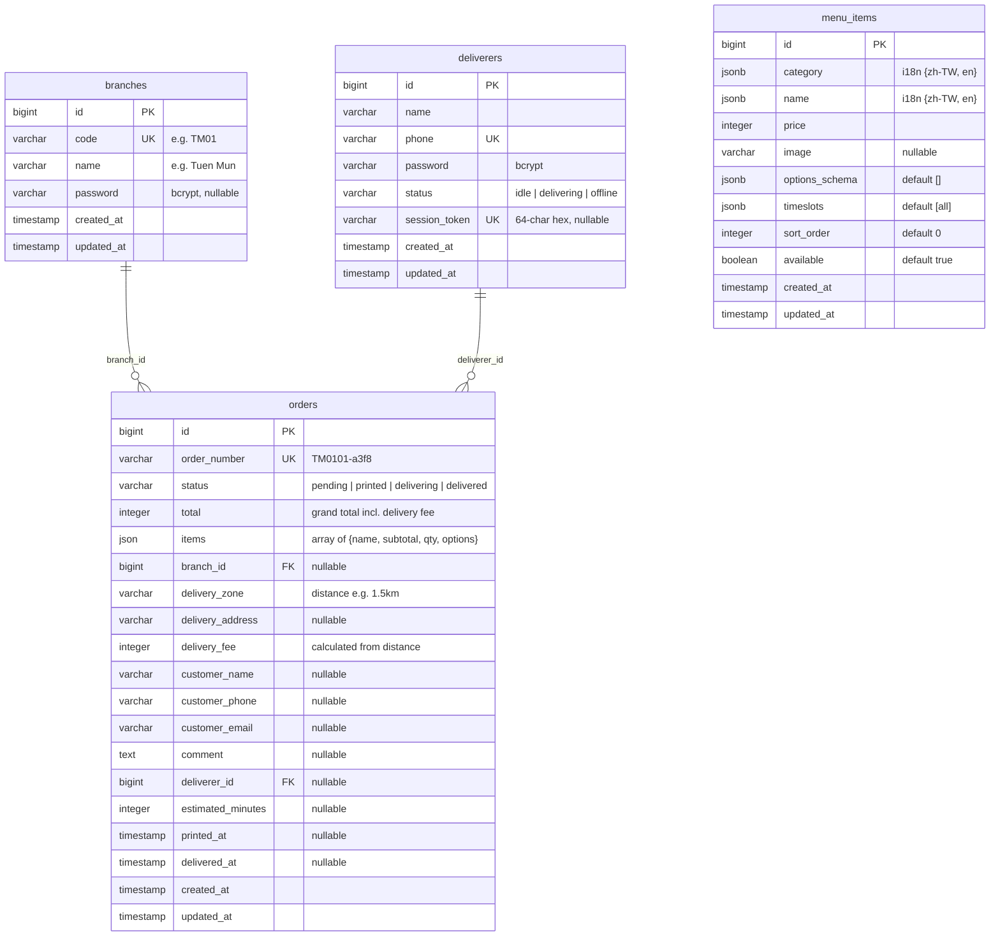
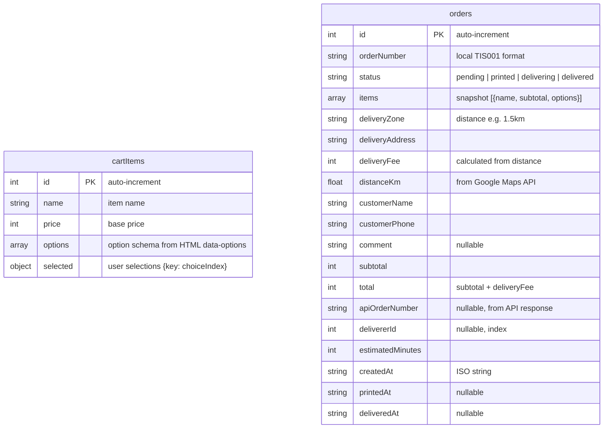
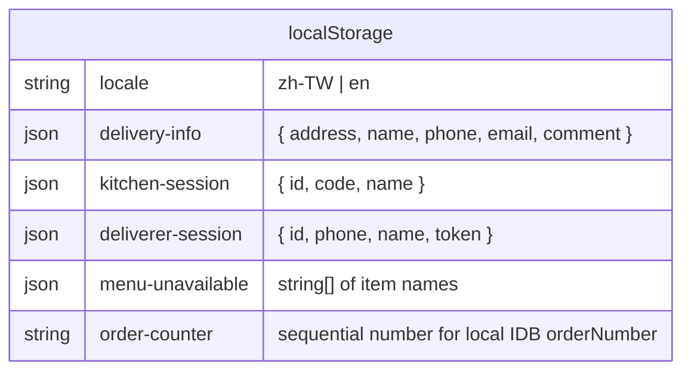
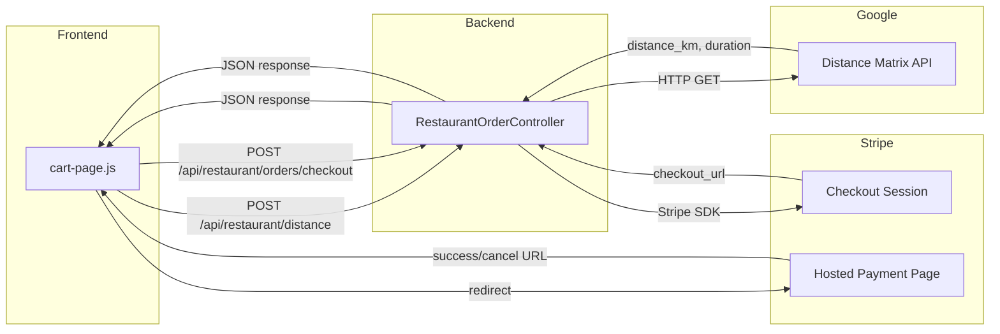

# Restaurant Module — ERD

> Last verified: 2026-03-20
> Database: PostgreSQL (`postgres` DB, `restaurant` connection)
> IndexedDB: Dexie v4 (`restaurant` database)

---

## PostgreSQL ERD (Server)



### Table Status (4 tables in DB)

| Table | Status | Notes |
|-------|--------|-------|
| `branches` | **ACTIVE** | 2 seeded rows (TM01, TSW01) |
| `orders` | **ACTIVE** | Core order table, items as JSON, delivery_zone stores distance (e.g. "1.5km") |
| `deliverers` | **ACTIVE** | Server-side session via `session_token` |
| `menu_items` | **UNUSED** | Menu hardcoded in HTML `data-*` attrs; table exists but empty |

Tables in migrations but **NOT in DB**: `order_items` (items stored as JSON), `restaurant_sessions` (dine-in removed).

### Dead Columns on `orders`

| Column | Why Dead |
|--------|----------|
| `qr_token` | Pickup code = `order_number` directly; never populated |
| `table_number` | Dine-in removed |
| `session_token` | Dine-in session; not the deliverer session |

### Missing Migration

| Column | Table | Status |
|--------|-------|--------|
| `session_token` | `deliverers` | Used by `RestaurantDelivererService` but **no migration** creates it. Likely added manually. Should formalize with migration. |
| `items` (json) | `orders` | Used by `RestaurantOrderService` but **no migration** adds it. Likely added manually. Should formalize with migration. |

---

## IndexedDB ERD (Client — Customer Only)



### IndexedDB Version History

| Version | Stores | Change |
|---------|--------|--------|
| v1 | cartItems, orders | Initial: `++id, name` / `++id, order_number, status, time` |
| v2 | cartItems, orders | Rename fields: `orderNumber, createdAt`. Clear old orders. |
| v3 | cartItems, orders, deliverers | Add deliverers store (phone, name, status) |
| v4 | cartItems, orders | **Drop deliverers** (moved to PostgreSQL) |

---

## localStorage Keys (All Interfaces)



| Key | Interface | Purpose |
|-----|-----------|---------|
| `locale` | All | Current language |
| `delivery-info` | Customer | Saved checkout form fields (address, name, phone, email, comment) |
| `kitchen-session` | Kitchen | Branch login state `{ id, code, name }` |
| `deliverer-session` | Deliverer | Login state `{ id, phone, name, token }` |
| `menu-unavailable` | Customer + Kitchen | Array of unavailable item names, cross-tab via `storage` event |
| `order-counter` | Customer | Local sequential counter for IDB orderNumber (TIS001, TIS002...) |

---

## External APIs



| API | Provider | Endpoint | Key | Pricing |
|-----|----------|----------|-----|---------|
| Distance Matrix | Google Cloud | `maps.googleapis.com/maps/api/distancematrix/json` | `GG_API` (server-side) | $5/1k calls, $200/mo free |
| Checkout Session | Stripe | `api.stripe.com` via PHP SDK | `STRIPE_SECRET` (server-side) | 2.9% + HK$2.35/txn (test mode = free) |

### Distance → Fee Calculation

```
Address input → POST /api/restaurant/distance → Google API → distance_km
                                                                │
                                                    ┌───────────┴───────────┐
                                                    │  Fee = (ceil(km)-1)*10 │
                                                    │  ≤1km  → $0           │
                                                    │  ≤2km  → $10          │
                                                    │  ≤3km  → $20          │
                                                    │  ≤4km  → $30          │
                                                    │  ≥5km  → unavailable  │
                                                    └───────────────────────┘
```

### Branch Origins (for distance calculation)

| Branch | Origin Address |
|--------|---------------|
| TM01 | Tuen Mun, Hong Kong |
| TSW01 | Tin Shui Wai, Hong Kong |
| Default | Tuen Mun, Hong Kong |

---

## Data Flow: Order Lifecycle

```
Customer                  Backend                    External             Kitchen/Deliverer
════════                  ═══════                    ════════             ═════════════════

Enter address ──────► POST /distance ──────► Google Maps API
                    ◄── distance_km ◄────── Distance Matrix

Verify: fee calc

Place order ────────► POST /orders ─────────────────────────────► WebSocket event
  (IDB + API)        status: pending                                 │
                          │                                          │
                    POST /orders/checkout ──► Stripe API             ▼
                    ◄── checkout_url ◄────── Checkout Session    Kitchen sees
                          │                                     pending order
Redirect ──────────► Stripe Payment Page                            │
                          │                                    PATCH: printed
Success URL ◄──────── Payment complete                              │
  ?payment=success                                                  │
                                                               Deliverer GET
History page                                                   by pickup code
  poll status                                                       │
  pending → "準備中"                                            PATCH: delivering
  printed → "等待外送員"                                        deliverer_id set
  delivering → "已結單"                                             │
  delivered → "已結單"                                          PATCH: delivered
                                                               delivered_at set
```

---

## API Routes (14 endpoints)

```
POST   /api/restaurant/distance                → Google Maps proxy
GET    /api/restaurant/branches                 → list branches
POST   /api/restaurant/branches                 → create branch
POST   /api/restaurant/branches/auth            → kitchen login

GET    /api/restaurant/orders?branch=           → today's orders
POST   /api/restaurant/orders                   → create order
POST   /api/restaurant/orders/checkout          → Stripe Checkout Session
DELETE /api/restaurant/orders?branch=           → clear orders (console)
GET    /api/restaurant/orders/pickup/{code}     → find by pickup code
GET    /api/restaurant/orders/deliverer/{id}    → orders for deliverer
GET    /api/restaurant/orders/{orderNumber}     → single order
PATCH  /api/restaurant/orders/{orderNumber}/status → update status

GET    /api/restaurant/deliverers               → list all
POST   /api/restaurant/deliverers               → register
POST   /api/restaurant/deliverers/auth          → login
POST   /api/restaurant/deliverers/logout        → clear session
GET    /api/restaurant/deliverers/me            → validate token
PATCH  /api/restaurant/deliverers/{id}/status   → update status
DELETE /api/restaurant/deliverers/{id}          → remove
```

---

## Relationship Summary

```
branches   1 ──── * orders    (branch_id FK, nullable, nullOnDelete)
deliverers 1 ──── * orders    (deliverer_id FK, nullable, nullOnDelete)
menu_items               (standalone, no FK — unused)
```

Active foreign keys: **2** (orders.branch_id → branches, orders.deliverer_id → deliverers)
