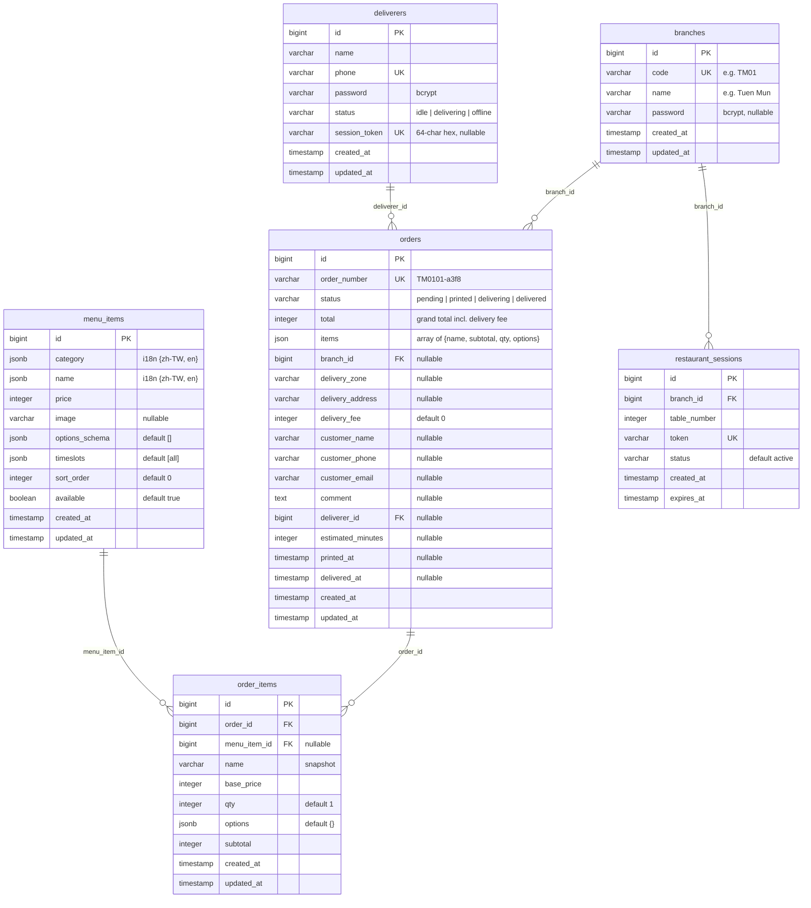
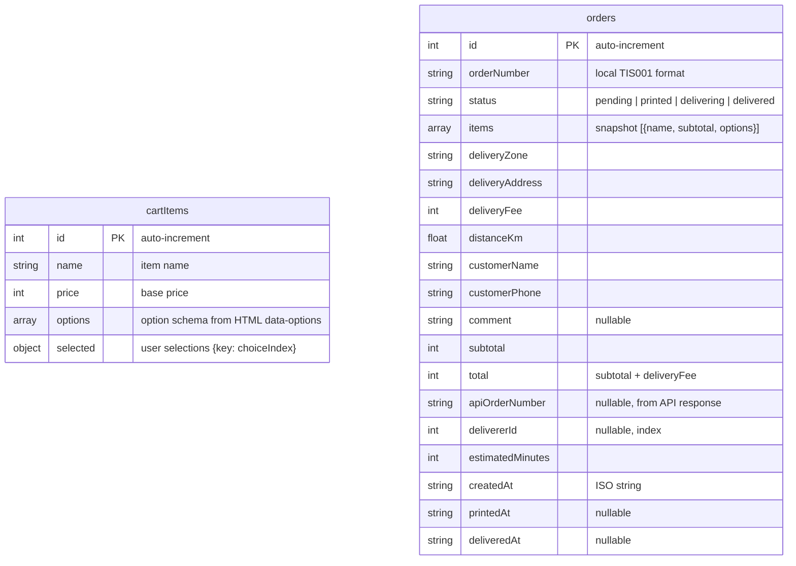
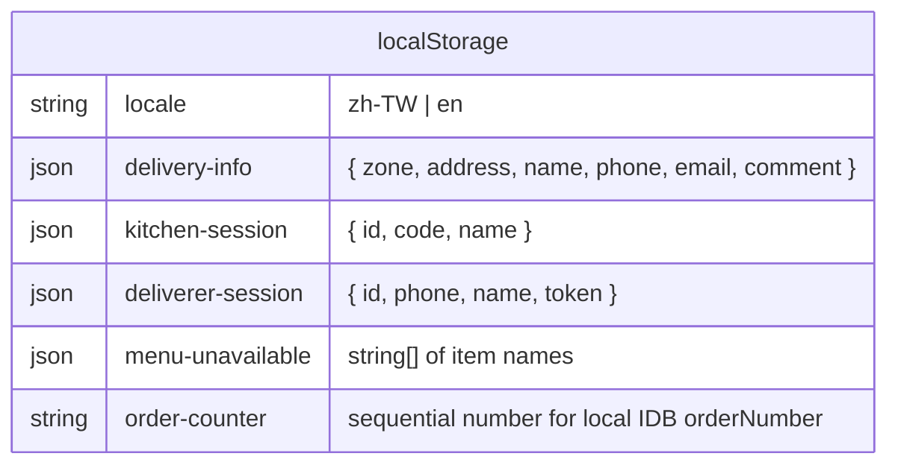

# Restaurant Module — ERD

> Last verified: 2026-03-19
> Database: PostgreSQL (`postgres` DB, `restaurant` connection)
> IndexedDB: Dexie v4 (`restaurant` database)

---

## PostgreSQL ERD (Server)



### Table Status

| Table | Status | Notes |
|-------|--------|-------|
| `branches` | **ACTIVE** | 2 seeded rows (TM01, TSW01) |
| `orders` | **ACTIVE** | Core order table, items stored as JSON column |
| `deliverers` | **ACTIVE** | Server-side session via `session_token` |
| `menu_items` | **DEAD** | Menu hardcoded in HTML `data-*` attrs; table exists but empty |
| `order_items` | **DEAD** | Replaced by `orders.items` JSON column; never written to |
| `restaurant_sessions` | **DEAD** | Dine-in feature removed; table exists but unused |

### Dead Columns on `orders`

| Column | Why Dead |
|--------|----------|
| `qr_token` | Pickup code = `order_number` directly; never populated |
| `table_number` | Dine-in removed |
| `session_token` | Dine-in session; not the deliverer session |

### Missing Migration

| Column | Table | Status |
|--------|-------|--------|
| `session_token` | `deliverers` | Used by `RestaurantDelivererService` but **no migration** creates it. Likely added manually. Should formalize with migration. |
| `items` (json) | `orders` | Used by `RestaurantOrderService` but **no migration** adds it. Likely added manually. Should formalize with migration. |

---

## IndexedDB ERD (Client — Customer Only)



### IndexedDB Version History

| Version | Stores | Change |
|---------|--------|--------|
| v1 | cartItems, orders | Initial: `++id, name` / `++id, order_number, status, time` |
| v2 | cartItems, orders | Rename fields: `orderNumber, createdAt`. Clear old orders. |
| v3 | cartItems, orders, deliverers | Add deliverers store (phone, name, status) |
| v4 | cartItems, orders | **Drop deliverers** (moved to PostgreSQL) |

---

## localStorage Keys (All Interfaces)



| Key | Interface | Purpose |
|-----|-----------|---------|
| `locale` | All | Current language |
| `delivery-info` | Customer | Saved checkout form fields for convenience |
| `kitchen-session` | Kitchen | Branch login state `{ id, code, name }` |
| `deliverer-session` | Deliverer | Login state `{ id, phone, name, token }` |
| `menu-unavailable` | Customer + Kitchen | Array of unavailable item names, cross-tab via `storage` event |
| `order-counter` | Customer | Local sequential counter for IDB orderNumber (TIS001, TIS002...) |

---

## Data Flow: Order Lifecycle

```
                    PostgreSQL                          IndexedDB
                    ══════════                          ═════════
Customer POST ─────► orders.insert ◄── Event ──┐        orders.add
  (cart-page)       status: pending             │        (local copy)
                         │                      │            │
Kitchen PATCH ──────► status: printed           │        poll ► apiOrderNumber
  (kitchen-page)         │                      │            │
                         │                      │        Status mapping:
Deliverer GET ──────► orders by pickup code     │        pending → "準備中"
  (delivery-page)        │                      │        printed → "等待外送員接單中"
                         │                      │        delivering → "已結單"
Deliverer PATCH ────► status: delivering        │        delivered → "已結單"
  (delivery-page)    deliverer_id: set          │
                         │                      │
Deliverer PATCH ────► status: delivered         │
  (delivery-task)    delivered_at: now()         │
                         │                      │
                    RestaurantOrderUpdated ──────┘
                    (WebSocket broadcast)
```

---

## Relationship Summary

```
branches  1 ──── * orders        (branch_id FK, nullable, nullOnDelete)
deliverers 1 ──── * orders        (deliverer_id FK, nullable, nullOnDelete)
menu_items 1 ──── * order_items   (DEAD — not used)
orders     1 ──── * order_items   (DEAD — not used)
branches   1 ──── * restaurant_sessions (DEAD — not used)
```

Active foreign keys: **2** (orders.branch_id → branches, orders.deliverer_id → deliverers)
Dead foreign keys: **3** (order_items.order_id, order_items.menu_item_id, restaurant_sessions.branch_id)
