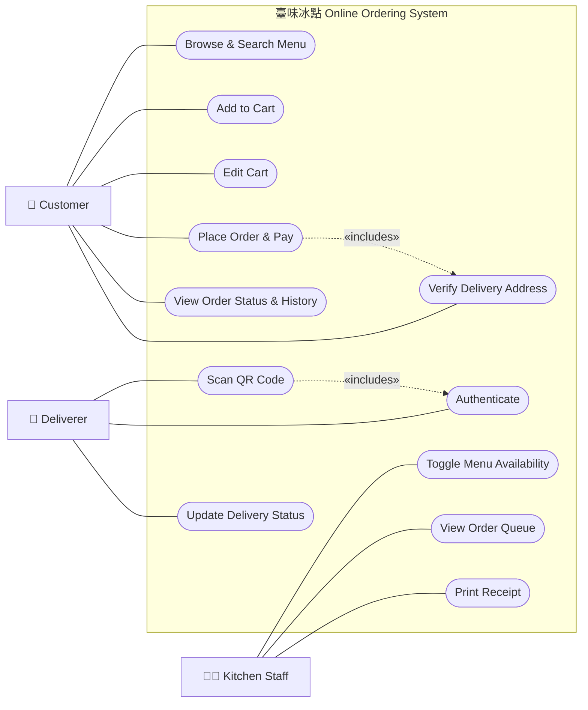
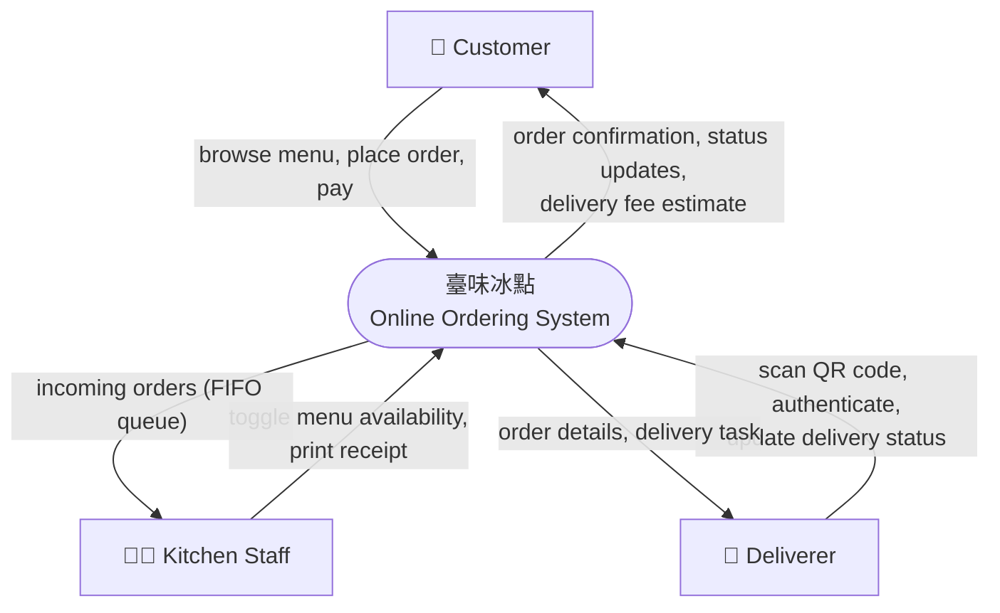
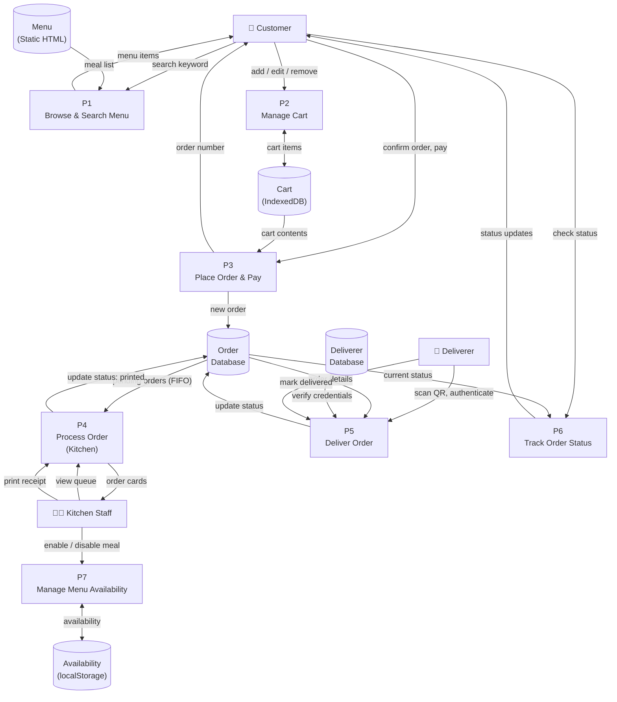

# SE Design Document — Diagrams (High Level)

---

## 1. Use Case Diagram

```mermaid
flowchart LR
    Customer["👤 Customer"]
    Kitchen["👨‍🍳 Kitchen Staff"]
    Deliverer["🚴 Deliverer"]

    subgraph System["臺味冰點 Online Ordering System"]
        UC1(["Browse & Search Menu"])
        UC2(["Add to Cart"])
        UC3(["Edit Cart"])
        UC4(["Place Order & Pay"])
        UC5(["View Order Status & History"])
        UC6(["Verify Delivery Address"])

        UC7(["Toggle Menu Availability"])
        UC8(["View Order Queue"])
        UC9(["Print Receipt"])

        UC10(["Scan QR Code"])
        UC11(["Authenticate"])
        UC12(["Update Delivery Status"])
    end

    Customer --- UC1
    Customer --- UC2
    Customer --- UC3
    Customer --- UC4
    Customer --- UC5
    Customer --- UC6

    Kitchen --- UC7
    Kitchen --- UC8
    Kitchen --- UC9

    Deliverer --- UC10
    Deliverer --- UC11
    Deliverer --- UC12

    UC4 -.->|"«includes»"| UC6
    UC10 -.->|"«includes»"| UC11
```

---

## 2. DFD Level 0 — Context Diagram

```mermaid
flowchart TB
    Customer["👤 Customer"]
    Kitchen["👨‍🍳 Kitchen Staff"]
    Deliverer["🚴 Deliverer"]

    System(["臺味冰點\nOnline Ordering System"])

    Customer -->|"browse menu, place order, pay"| System
    System -->|"order confirmation, status updates,\ndelivery fee estimate"| Customer

    Kitchen -->|"toggle menu availability,\nprint receipt"| System
    System -->|"incoming orders (FIFO queue)"| Kitchen

    Deliverer -->|"scan QR code, authenticate,\nupdate delivery status"| System
    System -->|"order details, delivery task"| Deliverer
```

---

## 3. DFD Level 1 — Process Decomposition

```mermaid
flowchart TB
    Customer["👤 Customer"]
    Kitchen["👨‍🍳 Kitchen Staff"]
    Deliverer["🚴 Deliverer"]

    P1["P1\nBrowse & Search Menu"]
    P2["P2\nManage Cart"]
    P3["P3\nPlace Order & Pay"]
    P4["P4\nProcess Order\n(Kitchen)"]
    P5["P5\nDeliver Order"]
    P6["P6\nTrack Order Status"]
    P7["P7\nManage Menu Availability"]

    DS1[("Menu\n(Static HTML)")]
    DS2[("Order\nDatabase")]
    DS3[("Cart\n(IndexedDB)")]
    DS4[("Deliverer\nDatabase")]
    DS5[("Availability\n(localStorage)")]

    Customer -->|"search keyword"| P1
    DS1 -->|"meal list"| P1
    P1 -->|"menu items"| Customer

    Customer -->|"add / edit / remove"| P2
    P2 <-->|"cart items"| DS3

    Customer -->|"confirm order, pay"| P3
    DS3 -->|"cart contents"| P3
    P3 -->|"new order"| DS2
    P3 -->|"order number"| Customer

    Kitchen -->|"view queue"| P4
    DS2 -->|"pending orders (FIFO)"| P4
    P4 -->|"order cards"| Kitchen
    Kitchen -->|"print receipt"| P4
    P4 -->|"update status: printed"| DS2

    Kitchen -->|"enable / disable meal"| P7
    P7 <-->|"availability"| DS5

    Deliverer -->|"scan QR, authenticate"| P5
    DS2 -->|"order details"| P5
    DS4 -->|"verify credentials"| P5
    Deliverer -->|"mark delivered"| P5
    P5 -->|"update status"| DS2

    Customer -->|"check status"| P6
    DS2 -->|"current status"| P6
    P6 -->|"status updates"| Customer
```
